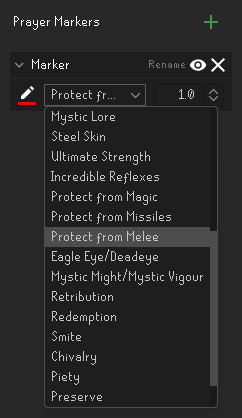
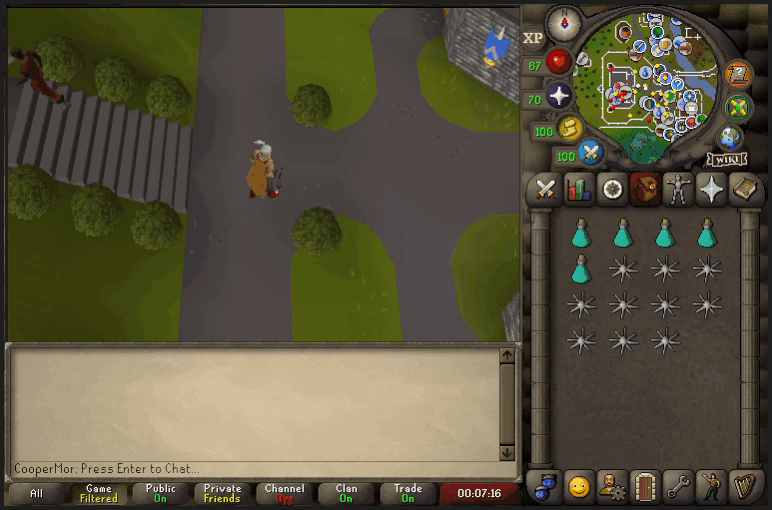
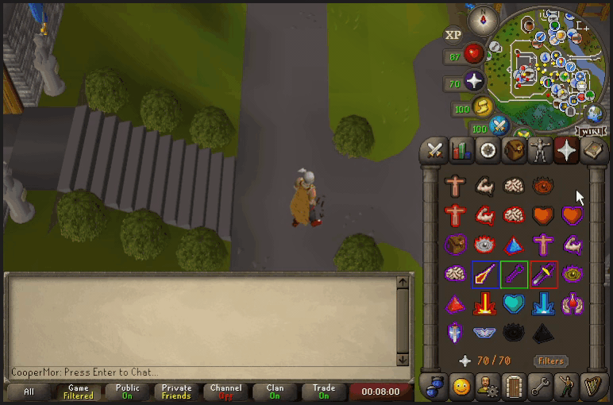

# Prayer Markers

Prayer markers allows you to add dynamic screen markers to the prayer interface. This plugin does **NOT** indicate what prayers to use.

Colored prayed markers can be added for any prayer with a configurable stroke thickness and color.

Prayer markers are only shown on the prayer interface.

Prayer markers will move with any interfaces being moved.

